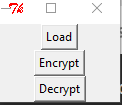

# PyCryption
## Table Of Contents
* [What Is This](#What-is-this "What is this")
* [Prerequisites](#Prerequisites "Prerequisites")
* [Quick Start](#Quick-Start "Quick Start")
* [Author](#Author "Author")
* [Screenshots](#Screenshot "Screenshots")
* [Licensing](#Licensing "Licensing")
<a name="What-is-this"><h1>What Is This</h1></a>
  
A lightweight chat utility written in python

<a name="Prerequisites"><h1>Prerequisites</h1></a>
* Download and install [Python](https://www.python.org/downloads/ "Download Python") (Python v2 works best)
* Download and install [Microsoft Visual C++ for Python](https://www.microsoft.com/en-us/download/details.aspx?id=44266 "Microsoft Visual C++ for Python") (for a Windows Machine)
* `easy_install pycrypto`
<a name="Quick-Start"><h1>Quick Start</h1></a>
* Clone this repo
* Navigate to the directory containing the project and type <code>python PyCrypto.py</code>
* Load in a text (.txt) file to encrypt the file and give it the .enc extension. Simply load in a .enc file to Decrypt.
<a name="Author"><h1>Author</h1></a>
  
This project was written for fun and to learn python and a simple example of AES encryption.
  This project was authored by William Jellesma. 

<a name="Screenshot"><h1>Screenshot</h1></a>

<a name="Licensing"><h1>Licensing</h1></a>

This Project is licensed under the <a href="http://choosealicense.com/licenses/mit/">MIT License</a>

